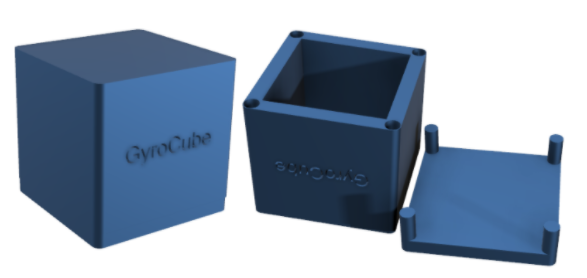
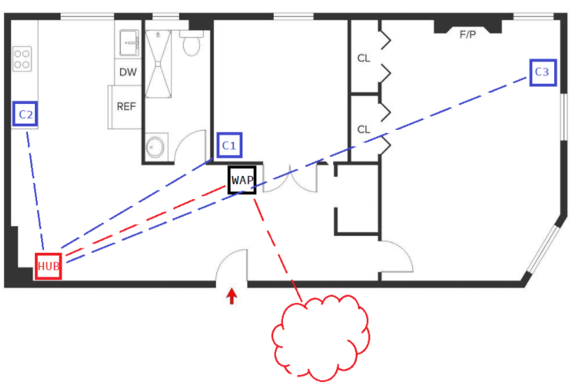
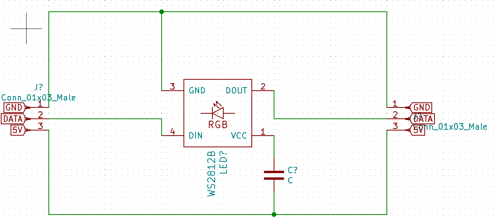

# Gyrocube PCB design

Project is ongoing.

## Concept description 

GyroCube is a Smart-Home accessory. The GyroCube is a multipurpose cube that can perform different functions based on the cube placing. The functionality is changed by simply flipping the cube on the table. The functionalities are humidity measurements, OMA notifications, and weather-forecasts. GyroCube uses vibration modules and LEDs as the output method to notify the user of changes.  
GyroCube consists of the main station and cubes that will be in constant M2M communication. The main station handles the sensor measurements and internet communications, while the cubes react to changes in the main station. Thus, allowing the GyroCube environment to be scalable, as the user can connect as many cubes as he wants. 
The goal is to provide the user with a delightful-looking home accessory, which will also allow them to obtain helpful information in a simple, minimalistic way. 

## Topology example - Star

The HUB acts as Zigbee coordinator/router, while the cubes are end devices of the topology. HUB communicates with Wireless Access Point.

## PCB design description

PCB design for the gyrocube IoT project. Consists of several parts: x6 RGB LED PCBs, cube's MCU and main hub's MCU.
External components were used when designing the schematics

<b>Hub PCB</b>: 
[Microcontroller](https://app.ultralibrarian.com/details/23afb9f1-10a0-11e9-ab3a-0a3560a4cccc/Microchip/PIC32MX575F512H-80I-PT?open=backlink) 
[RF Tranciever (Zigbee)](https://app.ultralibrarian.com/details/42fe3879-10a0-11e9-ab3a-0a3560a4cccc/Microchip/AT86RF231-ZU?uid=8d6b40c328af52ac) 
[Wi-Fi Module](https://app.ultralibrarian.com/details/2b6afdaf-b24e-11ea-b5d0-0aebb021a1ea/Silicon-Labs/WFM200S022XNA2?uid=52bf9d8b68458d78)

<b>Cube MCU</b>: 
[Microcontroller](https://app.ultralibrarian.com/details/4b4afbe8-2e28-11eb-9033-0a34d6323d74/Microchip/PIC18F47K40-I-P?uid=9581580b9c884a46&exports=KiCAD&open=exports)
[Gyroscope](https://app.ultralibrarian.com/details/68dbfc0c-1e52-11eb-9033-0a34d6323d74/STMicroelectronics/L3GD20H?uid=c097080110371f50)
Humidity/Temperature sensor is custom. The library is cached in the respective folder.

### LED PCB design:

Uses ws2812b-5050 LED and 1000 uF filtering capacitor.

